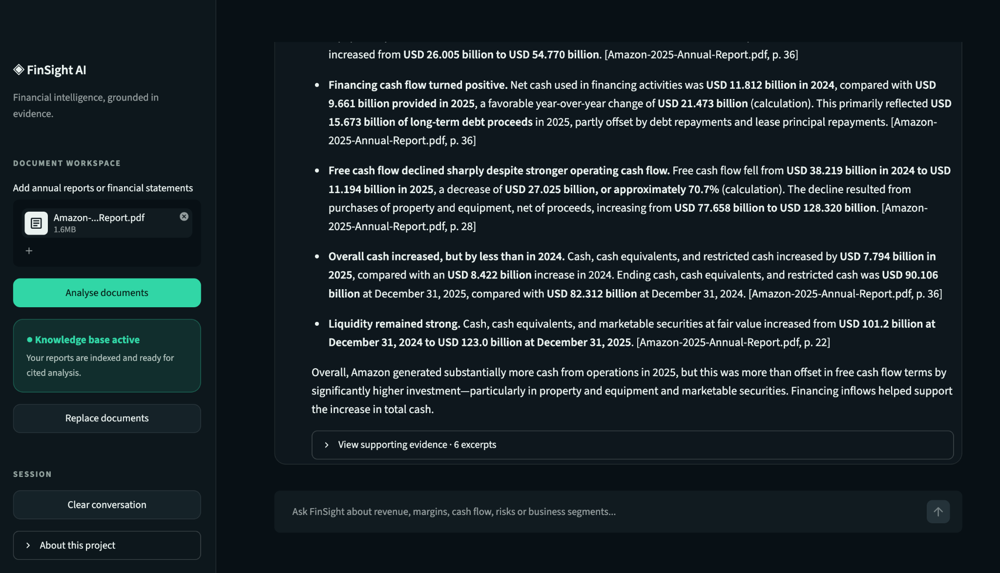
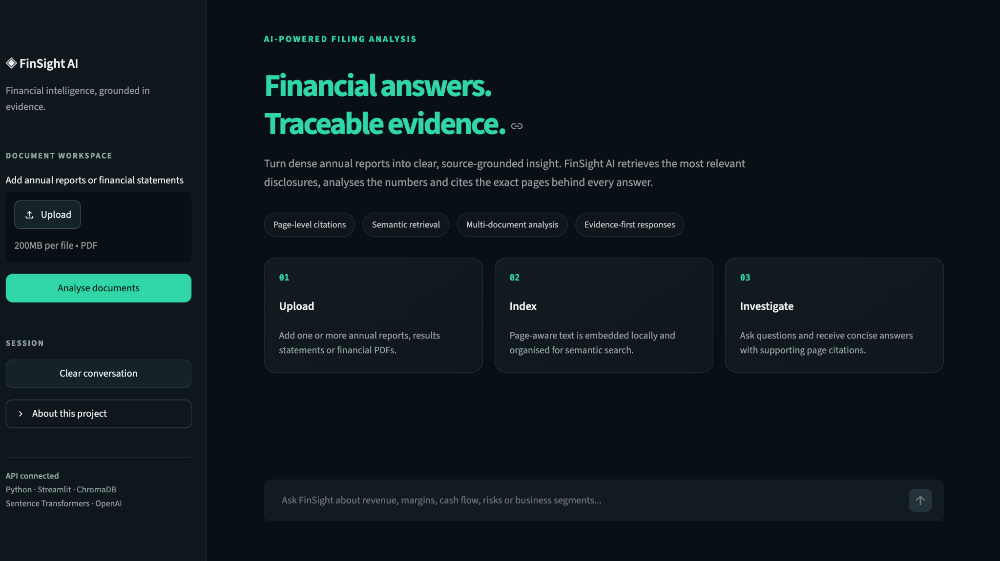
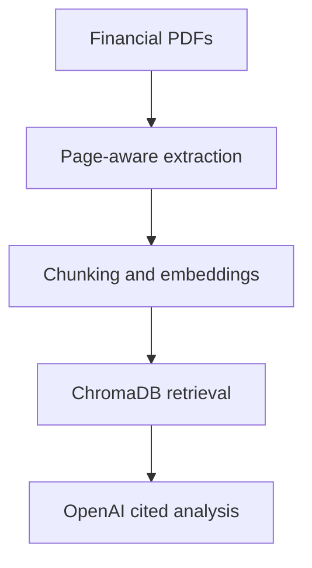

# FinSight AI

### Financial answers. Traceable evidence.

FinSight AI is a retrieval-augmented financial research application that turns
dense annual reports into clear, page-cited analysis. Users can upload one or
more financial PDFs, ask natural-language questions and inspect the exact
evidence retrieved for every answer.



## Why I built it

Annual reports contain valuable information, but finding and comparing the
right disclosures is slow. FinSight AI reduces that friction by combining
semantic search with evidence-constrained language-model analysis. The aim is
not to replace financial judgement; it is to make source material faster to
interrogate and easier to verify.

## Core capabilities

- Upload and analyse multiple annual reports or financial-statement PDFs.
- Extract page-aware text while retaining filenames and page numbers.
- Split filings into overlapping evidence sections for reliable retrieval.
- Generate local sentence-transformer embeddings and store them in ChromaDB.
- Retrieve the most relevant evidence for each question.
- Produce concise OpenAI-generated answers grounded only in retrieved text.
- Cite material claims using the source filename and page number.
- Display the underlying evidence and semantic match scores.
- Calculate and clearly label derived financial changes and comparisons.

## Application preview



## Technical architecture



| Layer | Technology | Purpose |
| --- | --- | --- |
| Interface | Streamlit | Upload, workflow, chat and evidence presentation |
| Extraction | pypdf | Page-level PDF text extraction |
| Embeddings | Sentence Transformers | Local semantic vector generation |
| Retrieval | ChromaDB | Similarity search over financial disclosures |
| Analysis | OpenAI Responses API | Evidence-constrained answers and calculations |
| Configuration | python-dotenv | Local secret and model configuration |

## Retrieval workflow

1. The user uploads one or more text-based PDFs.
2. FinSight extracts text page by page and normalises whitespace.
3. Each page is divided into overlapping 350-word sections.
4. A local sentence-transformer model embeds every section.
5. ChromaDB retrieves the six closest sections for each question.
6. The OpenAI model receives only the retrieved evidence, recent conversation
   context and strict citation instructions.
7. The interface shows the response alongside expandable source excerpts.

## Run locally on macOS

Clone the repository and enter it:

```bash
git clone YOUR_REPOSITORY_URL
cd finstatement-qa-bot
```

Create and activate a virtual environment:

```bash
python3 -m venv .venv
source .venv/bin/activate
```

Install the dependencies:

```bash
python -m pip install -r requirements.txt
```

Create a `.env` file from the supplied template:

```bash
cp .env.example .env
```

Add your OpenAI API key to `.env`:

```dotenv
OPENAI_API_KEY=your_real_key_here
OPENAI_MODEL=gpt-5.6-luna
```

Run the application:

```bash
streamlit run app/streamlit_app.py
```

## Security

The repository ignores `.env`, `.venv`, local caches and Streamlit secrets.
Never commit an API key. If a key is ever exposed, revoke it immediately and
create a replacement in the OpenAI dashboard.

## Limitations

- Scanned or image-only reports require OCR before ingestion.
- Retrieval quality depends on the quality of the extracted PDF text.
- Outputs should be verified against the cited evidence before being used.
- The application is a research demonstration, not financial advice.

## Potential extensions

- Table-aware extraction for complex financial statements.
- Cross-company benchmarking and ratio analysis.
- Persistent document collections and user authentication.
- Automated evaluation of retrieval and citation accuracy.
- Protected public deployment with usage controls.

## Project structure

```text
finstatement-qa-bot/
├── app/
│   └── streamlit_app.py
├── src/
│   ├── __init__.py
│   ├── ingest.py
│   └── qa_chain.py
├── assets/
│   ├── finsight-analysis.png
│   └── finsight-home.png
├── .streamlit/
│   └── config.toml
├── .env.example
├── .gitignore
├── requirements.txt
└── README.md
```

## CV summary

> Built FinSight AI, a retrieval-augmented financial research application using
> Python, Streamlit, ChromaDB, sentence-transformer embeddings and OpenAI,
> enabling semantic analysis of company filings with page-level citations and
> automated financial calculations.
